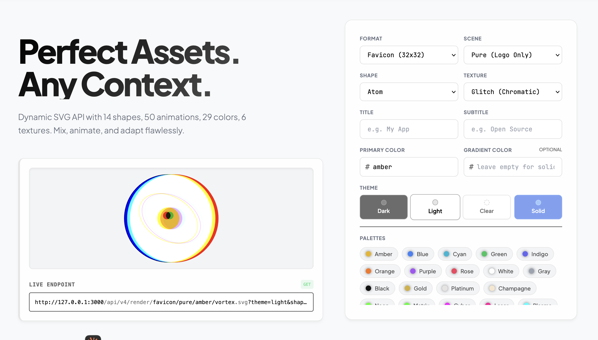

# Logos API

High-performance dynamic SVG asset generation service built in Go. Single binary, embedded dashboard, zero runtime external dependencies (airgapped ready).



## Quick Start

```bash
# Server
make run

# CLI
./logos render --color=neon --animation=vortex --texture=glitch --shape=lucide:rocket > logo.svg

# Docker
docker compose up -d
```

Dashboard at `http://localhost:3000`.

## Airgapped / Offline

- The dashboard is served from the Go binary (embedded files) and uses only local CSS/JS.
- No CDN, no Google Fonts, no remote assets required at runtime.
- Configuration: the server loads `config.yaml` if present, otherwise falls back to `config.sample.yaml`.

## API

### V4 Cinematic

```
GET /api/v4/render/{format}/{scene}/{color1}/{animation}.svg
GET /api/v4/render/{format}/{scene}/{color1}/{color2}/{animation}.svg
```

#### Query Parameters

| Param | Type | Description |
|---|---|---|
| `shape` | string | Built-in (`shield`, `hexagon`...) or icon pack (`lucide:rocket`, `hero:fire`) |
| `theme` | string | 51 themes: `dark`, `dracula`, `catppuccin`, `tokyo-night`, `vercel`, `stripe`... |
| `texture` | string | 20 filters: `grain`, `glass`, `glitch`, `watercolor`, `halftone`, `vhs`... |
| `variant` | string | 50 variants: `outline`, `badge`, `glow`, `neon-outline`, `disco`, `wireframe-3d`... |
| `title` | string | Title text overlay |
| `subtitle` | string | Subtitle text overlay |
| `stroke` | float | Stroke width (0-10) |
| `padding` | float | ViewBox padding (0-20) |
| `alpha` | float | Opacity (0.0-1.0) |
| `badge` | int | Notification dot (1-999) |
| `speed` | float | Animation speed multiplier (0.1-10) |
| `direction` | string | `reverse`, `alternate`, `alternate-reverse` |
| `hover` | bool | Inject `:hover` brightness |
| `decorative` | bool | `aria-hidden="true"` |

#### Examples

```
/api/v4/render/favicon/pure/blue/vortex.svg
/api/v4/render/og-card/spotlight/amber/cyan/pulse.svg?theme=dracula&title=MyApp
/api/v4/render/hero/stars/neon/laser/spin.svg?texture=glitch&variant=neon-outline
/api/v4/render/twitter-card/aurora-bg/rose-400/breathe.svg?shape=lucide:heart&variant=glow
/api/v4/render/instagram-post/isometric/emerald-500/zen.svg?shape=hero:shield-check&theme=supabase
```

### Generative Endpoint

```
GET /api/v4/gen/render?prompt=cyberpunk+hacker+glowing&format=avatar
GET /api/v4/gen/resolve?prompt=...  (JSON debug)
```

Text prompt resolves to parameters via semantic keyword matching + generates a unique procedural geometry (hash-seeded math on 256x256 grid, infinite upscale via viewBox).

### Icon Packs

```
GET /api/v4/icons?pack=lucide&q=rocket  (search/list)
```

2018 embedded icons: **Lucide** (1694, ISC license) + **Heroicons** (324, MIT license). Use via `?shape=lucide:rocket` or `?shape=hero:fire`.

### App Shortcuts

```
GET /app/{name}/{format}.svg
```

Register in `config.yaml` (or copy `config.sample.yaml` to `config.yaml` and edit):

```yaml
apps:
  my-app:
    color: cyan
    animation: zen
    shape: atom
    title: My App
    texture: glass
```

### Other Endpoints

| Endpoint | Description |
|---|---|
| `GET /healthz` | Health check |
| `GET /cache/stats` | Cache tier stats (admin-only) |
| `POST /cache/purge` | Clear all cache tiers (admin-only) |

Admin endpoints require `X-Admin-Key` and are disabled when `server.admin_key` is empty.

## Shapes (2047)

**29 built-in**: atom, shield, hexagon, diamond, bolt, cube, wave, gear, eye, leaf, star, circle, triangle, square, pentagon, octagon, cross, heart, cloud, flame, droplet, moon, sun, arrow, lock, infinity, crown, pill, target

Note: I use the built-in `atom` icon as the default mark across my projects.

**2018 icon packs**: `lucide:{name}` (1694 icons) + `hero:{name}` (324 icons) — browse in dashboard or search via `/api/v4/icons`

## Colors (315)

**Base** (8): amber, blue, cyan, green, indigo, orange, purple, rose

**Creative** (21): white, gray, black, gold, platinum, champagne, neon, matrix, cyber, laser, plasma, void, emerald, sapphire, ruby, ocean, sunset, magma, mint, peach, lavender

**Tailwind** (286): Full v3 palette — `slate-50` through `rose-950` (22 hues x 13 shades)

Custom hex also supported (e.g., `ff6600`).

## Animations (50)

static, zen, breathe, levitate, glimmer, spin, spin-fast, smooth-spin, orbit-chase, compass, gyro, satellite, eclipse, pulse, heartbeat, pulse-ring, strobe, nova, elastic, flip, orbit-tilt, vortex, harmony, sync, sway, radar, radar-sweep, signal, glow, aurora, nebula, corona, ripple-core, morph, morph-blob, morph-crystal, bounce, bounce-drop, trampoline, shake, jitter, earthquake, swing, pendulum, wave-swing, zoom-in, zoom-out, zoom-pulse, slide-in, slide-loop, typewriter-blink

Multiply with `?speed=0.25` to `?speed=4` and `?direction=reverse|alternate`.

## Variants (50)

| Category | Variants |
|---|---|
| Structure | outline, solid, flat, badge, ring, minimal, cutout |
| Opacity | ghost, duotone, duotone-dark, pastel |
| Effects | glow, neon-outline, neon-text, glass-morph, emboss, shadow-lift, long-shadow, shadow-colored |
| Stroke | thin, thick, stamp, dotted, sketch, sticker, double |
| Color | inverted, monochrome, sepia, invert-colors, hue-rotate, warm, cool |
| Transform | mirror, flip-v, rotate-45, rotate-90, rotate-180, scale-sm, scale-lg, wireframe-3d |
| Animated | disco, glitch-shift |
| Special | retro, xray, half, blur, pixel, scan-line |

## Textures (20)

| Texture | Effect |
|---|---|
| `grain` | Analog film noise |
| `glass` | Frosted glass refraction |
| `noise` | Digital noise overlay |
| `glitch` | Chromatic aberration (RGB split) |
| `shadow` | Multi-layer soft drop shadow |
| `neon` | Neon outer glow |
| `pencil` | Pencil sketch displacement |
| `watercolor` | Watercolor bleed |
| `halftone` | Halftone dot pattern |
| `vhs` | VHS horizontal distortion |
| `frost` | Ice crystalline |
| `ripple` | Water ripple |
| `burn` | Overexposed edges |
| `emboss-tex` | Embossed surface |
| `sharpen` | Edge sharpening |
| `erode` / `dilate` | Morphology operations |
| `outline-glow` | Outline with soft glow |
| `duotone-filter` | Duotone color mapping |

## Scenes (30)

| Category | Scenes |
|---|---|
| Core | pure, spotlight, grid, split |
| Patterns | dots, diagonal, crosshatch, waves-bg, diamond-grid, brick, triangle-grid, plus-grid, hexgrid, isometric, circuit, scanlines |
| Gradients | gradient, radial, vignette, aurora-bg, spotlight-color, corner-glow, dual-glow, concentric |
| Topographic | topography, stars |
| Solid | paper, white, black, noise-bg |

## Themes (51)

| Category | Themes |
|---|---|
| Core | dark, light, solid, glass, auto |
| Editor | monokai, dracula, nord, solarized-dark/light, gruvbox, catppuccin, tokyo-night, one-dark, github-dark/light, ayu-dark/light, material/light, night-owl, poimandres, vesper, synthwave-84, cobalt2, palenight, shades-of-purple, atom-one-light, high-contrast/light |
| Aesthetic | midnight, sunset-theme, ocean-theme, forest-theme, lavender-theme, ember, arctic, sandstorm, cherry, matrix-theme |
| Platform | slack, discord, notion/light, linear, vercel, stripe, supabase |

## Formats

Favicons, app icons, social media (Twitter, Facebook, Instagram, LinkedIn, YouTube), chat (Slack, Discord, Teams, Notion), devices (mobile, tablet, desktop, 4K), PWA manifest, banners, and standard squares.

## Cache (4-tier)

```
Client -> CDN (L4) -> Go Server -> L1 Memory LRU -> L2 Disk -> L3 Redis -> Render
```

| Tier | Latency | Config |
|---|---|---|
| L1 Memory | ~20ns | Always on, 10K LRU |
| L2 Disk | ~1ms | `l2_disk.enabled: true` |
| L3 Redis | ~2ms | `l3_redis.enabled: true` |
| L4 CDN | 0ms | `Surrogate-Key` + `Cache-Tag` headers |

## Accessibility

Every SVG includes: `role="img"`, `<title>`, `<desc>`, `prefers-reduced-motion`, `forced-colors`, `vector-effect="non-scaling-stroke"`, `Save-Data` detection, `aria-hidden` option.

## Performance

- 10MB static binary (2018 icons embedded)
- SVG render: <100us, cache hit: <50us
- `sync.Pool` buffer reuse, gzip compression
- ETag + 304, Stale-While-Revalidate
- Pre-warm apps on startup

## Docker

Distroless, non-root, read-only FS, `cap_drop: ALL`:

```bash
docker compose up -d
```

## Third-Party Licenses

Icon packs: Lucide (ISC), Heroicons (MIT). See [THIRD_PARTY_LICENSES.md](file:///Users/fab/Documents/git/logos/THIRD_PARTY_LICENSES.md).

## License

[MIT](LICENSE)
